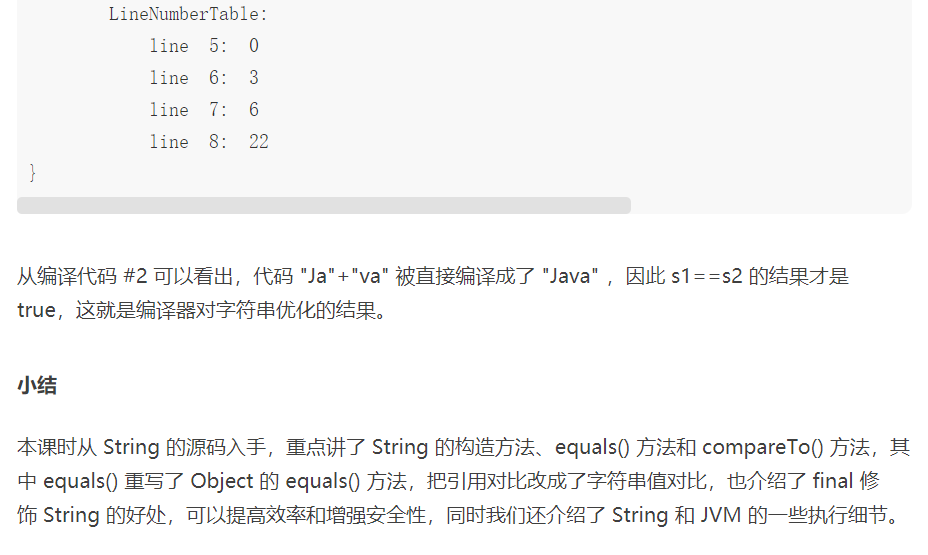

##### String 的特点是什么？它有哪些重要的方法？





##### 集合框架 List和Set的contains()以及Map的containsKey()、containsValue()

​		如何判断集合中是否存在某个元素——contains()
　　1.List的contains(obj)方法

　　实际上，List调用contains(Object obj)方法时，会遍历List中的每一个元素，然后再调用每个元素的equals()方法去跟contains()方法中的参数进行比较，如果有一个元素的equals()方法返回true则contains()方法返回true，否则所有equals()方法都不返回true，则ontains()方法则返回false。因此，重写了Course类的equals()方法，否则，testListContains()方法的第二条输出为false。

　　2.Set的Contains(obj)方法

　　当调用HashSet的contains(Object obj)方法时，其实是先调用每个元素的hashCode()方法来返回哈希码，如果哈希码的值相等的情况下再调用equals(obj)方法去判断是否相等，只有在这两个方法所返回的值都相等的情况下，才判定这个HashSet包含某个元素。

​		3.Map中是否包含指定的Key和Value

　　在Map中，用containsKey()方法，判断是否包含某个Key值；用containsValue()方法，判断是否包含某个Value值。

​		跟List中的Contains()方法一样，Map中的ContainsValue()方法也需要调用某个Value值的equals()方法，去和参数对象进行比较，如果匹配成功，返回结果为true，说明在Map中的Value值确实包含参数对象。

##### String 与 Char转换

Java中char是一个基本类型，而String是一个引用类型。有时候我们需要在String 与 char 之间互相转换。

**String 转为 char**
使用 String.charAt( index ) 方法，返回在index位置的char字符。(返回值：char )
使用 String.toCharArray( ) 方法，将String 转化为 字符串数组。(返回值：char[] ) 

**char 转为 String**
//1.效率最高得到一种方法
 String s = String.valueOf('c');

//2.将字符串数组转化为字符串
String s = String.valueOf(new char[] {'G','e','o','o','o'});

//3.用 Character 的 toString(char) 方法  ==>  实际上还是调用了String.valueOf(char)
String s = Character.toString('c');

//4.new 一个 Character 调用 toString()
String s = new Character('c').toString();

//5.直接用 空 String 拼接 'c'
String s = "" + 'c' ;

//第5种方法效率最低，因为String类是 final 属性
// "" + 'c' 时候需要创建新的 String 类 ，如果进行很多次拼接则要创建很多个类虚拟机栈可能会溢出

##### JAVA之字母与相对应数字转换

26个字母大小写加起来就是52个。对应的数字范围

System.out.println((char)97);//a
System.out.println((char)122);//z
System.out.println((char)65);//A
System.out.println((char)90);//Z

小写的范围为97...122大写的为65...90


//将字母转为数字
System.out.println("Z".getBytes()[0]);//90

//48-57对应0...9
System.out.println((char)48);
System.out.println((char)57);

##### Java8 对Map进行排序

前言：
    随着Java 8 的Stream之后推出后可以很优雅实现Map的排序。

示例：

final Map<String, Integer> wordCounts = new HashMap<>();
wordCounts.put("USA", 100);
wordCounts.put("jobs", 200);
wordCounts.put("software", 50);
wordCounts.put("technology", 70);
wordCounts.put("opportunity", 200);

//{USA=100, software=50, jobs=200, opportunity=200, technology=70}
按升序对值进行排序，使用LinkedHashMap存储排序结果来保留结果映射中元素的顺序

1、正向 
final Map<String, Integer> sortedByCount = wordCounts.entrySet()
                .stream()
                .sorted(Map.Entry.comparingByValue())
                .collect(Collectors.toMap(Map.Entry::getKey, Map.Entry::getValue, (e1, e2) -> e1, LinkedHashMap::new));

//{software=50, technology=70, USA=100, jobs=200, opportunity=200}

2、反向 reversed
final Map<String, Integer> sortedByCount1 = wordCounts.entrySet()
        .stream()
        .sorted((Map.Entry.<String, Integer>comparingByValue().reversed()))
        .collect(Collectors.toMap(Map.Entry::getKey, Map.Entry::getValue, (e1, e2) -> e1, LinkedHashMap::new));

//{jobs=200, opportunity=200, USA=100, technology=70, software=50}
推荐

sorted()方法将Comparator作为参数使用任何类型的值对映射进行排序。上面的排序可以用Comparator写成：

//正向 
  final Map<String, Integer> sortedByCount3 = wordCounts.entrySet()
        .stream()
        .sorted((e1, e2) -> e1.getValue().compareTo(e2.getValue()))
        .collect(Collectors.toMap(Map.Entry::getKey, Map.Entry::getValue, (e1, e2) -> e1, LinkedHashMap::new));
//{software=50, technology=70, USA=100, jobs=200, opportunity=200}


//反向 == reversed()
final Map<String, Integer> sortedByCount2 = wordCounts.entrySet()
                .stream()
                .sorted((e1, e2) -> e2.getValue().compareTo(e1.getValue()))
                .collect(Collectors.toMap(Map.Entry::getKey, Map.Entry::getValue, (e1, e2) -> e1, LinkedHashMap::new));

//{jobs=200, opportunity=200, USA=100, technology=70, software=50}

##### Java中Map的 entrySet() 详解以及用法(四种遍历map的方式)

Entry
由于Map中存放的元素均为键值对，故每一个键值对必然存在一个映射关系。 
Map中采用Entry内部类来表示一个映射项，映射项包含Key和Value (我们总说键值对键值对, 每一个键值对也就是一个Entry)
Map.Entry里面包含getKey()和getValue()方法

Iterator<Map.Entry<Integer, Integer>> it=map.entrySet().iterator();
    while(it.hasNext()) {
        Map.Entry<Integer,Integer> entry=it.next();
        int key=entry.getKey();
        int value=entry.getValue();
        System.out.println(key+" "+value);
  	}
**entrySet**
entrySet是 java中 键-值 对的集合，Set里面的类型是Map.Entry，一般可以通过map.entrySet()得到。

entrySet实现了Set接口，里面存放的是键值对。一个K对应一个V。
用来遍历map的一种方法。

```java
Set<Map.Entry<String, String>> entryseSet=map.entrySet();
for (Map.Entry<String, String> entry:entryseSet) {
	System.out.println(entry.getKey()+","+entry.getValue());
}
```


即通过getKey（）得到K，getValue得到V。

keySet
还有一种是keySet, keySet是键的集合，Set里面的类型即key的类型

```java
Set<String> set = map.keySet();
for (String s:set) {
	System.out.println(s+","+map.get(s));
}
```


四种遍历Map方式:

```java
public static void main(String[] args) {
    Map<String, String> map = new HashMap<String, String>();
    map.put("1", "value1");
    map.put("2", "value2");
    map.put("3", "value3");

    //第一种：普遍使用，二次取值
    System.out.println("通过Map.keySet遍历key和value：");
    for (String key : map.keySet()) {
        System.out.println("key= "+ key + " and value= " + map.get(key));
    }

    //第二种
    System.out.println("通过Map.entrySet使用iterator遍历key和value：");
    Iterator<Map.Entry<String, String>> it = map.entrySet().iterator();
    while (it.hasNext()) {
        Map.Entry<String, String> entry = it.next();
        System.out.println("key= " + entry.getKey() + " and value= " + entry.getValue());
    }

    //第三种：推荐，尤其是容量大时
    System.out.println("通过Map.entrySet遍历key和value");
    for (Map.Entry<String, String> entry : map.entrySet()) {
        System.out.println("key= " + entry.getKey() + " and value= " + entry.getValue());
    }

    //第四种
    System.out.println("通过Map.values()遍历所有的value，但不能遍历key");
    for (String v : map.values()) {
        System.out.println("value= " + v);
    }
}
```
stream()方法和collect()方法都是java8的新特性

stream()优点

​		无存储。stream不是一种数据结构，它只是某种数据源的一个视图，数据源可以是一个数组，Java容器或I/O channel等。
​		为函数式编程而生。对stream的任何修改都不会修改背后的数据源，比如对stream执行过滤操作并不会删除被过滤的元素，而是会产生一个不包含被过滤元素的新stream。
​		惰式执行。stream上的操作并不会立即执行，只有等到用户真正需要结果的时候才会执行。
​		可消费性。stream只能被“消费”一次，一旦遍历过就会失效，就像容器的迭代器那样，想要再次遍历必须重新生成。

 Collectors类的tomap（）方法。它允许我们从流中创建一个新的映射。

```java
.stream()
.sorted((e1, e2) -> e2.getValue().compareTo(e1.getValue()))
.collect(Collectors.toMap(Map.Entry::getKey, Map.Entry::getValue, (e1, e2) -> e1, LinkedHashMap::new))
```

.sorted：排序

.collect：进行聚合成map

Collectors.toMap：

```Java
Collector<T, ?, M> toMap(Function<? super T, ? extends K> keyMapper,
  Function<? super T, ? extends U> valueMapper,
  BinaryOperator<U> mergeFunction,
  Supplier<M> mapSupplier)
```

mergeFunction：合并函数，它指出在发生冲突的情况下进行何种操作；例如：新值替换旧值

mapSupplier：返回不同的映射实现；例如：LinkedHashMap::new