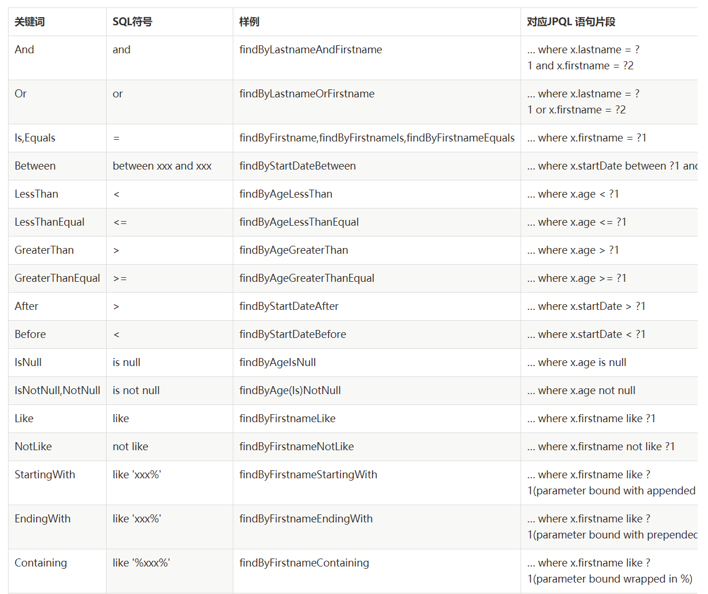
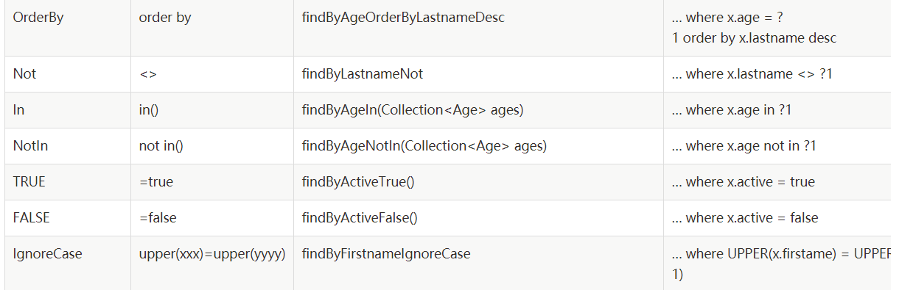

#### 谈hibernate，jpa与spring data jpa三者之间的关系

##### 前提

其实很多框架都是对另一个框架的封装，我们在学习类似的框架的时候，难免会进入误区，所以我们就应该对其进行总结归纳，对比。
本文就是对hibernate，jpa，spring data jpa三者之间进行文字对比，以及对其三者分别进行CRUD操作。

##### 文字说明

###### Hibernate

Hibernate是一个开放源代码的对象关系映射框架，它对JDBC进行了非常轻量级的对象封装，它将POJO与数据库表建立映射关系，是一个全自动的orm框架，hibernate可以自动生成SQL语句，自动执行，使得Java程序员可以随心所欲的使用对象编程思维来操纵数据库。

###### JPA

- JPA全称是Java Persistence API，即java持久化API，是sun公司推出的一套基于ORM的规范，内部由一系列的接口和抽象类构成。
- Sun提出此规范有2个原因：
  1.简化现有Java EE和Java SE应用开发工作。
  2.Sun希望整合ORM技术，实现天下归一。
- 重点在于，JPA是一套规范，而不是具体的ORM框架。
- 故Hibernate、TopLink 等ORM框架 都是JPA的实现，其中Hibernate已获得Sun的兼容认证。
- JPA的标准的定制是hibernate作者参与定制的，所以JPA是Hibernate的一个总成。
- 优势在于：
  1.开发者面向JPA规范的接口，但底层的JPA实现可以任意切换：觉得Hibernate好的，可以选择Hibernate JPA实现；觉得TopLink好的，可以选择TopLink JPA实现。
  2.这样开发者可以避免为使用Hibernate学习一套ORM框架，为使用TopLink又要再学习一套ORM框架。
- 在项目中使用方式为：在实体类中，使用 `@Entity` 、 `@Table` 、`@Id` 与 `@Column` 等注解。
- 示例代码如下：

```
import javax.persistence.*;
import javax.persistence.Id;

@Entity
@Table(name = "t_user")//数据库中表名
public class UserEO {
    @Id
    @Column(name = "USER_ID")//数据库中字段名
    private String userId;

    @Column(name = "USER_NAME")
    private String  userName;
   
}
```

###### JPA与Hibetnate的关系

JPA和Hibernate的关系就像JDBC和JDBC驱动的关系，JPA是规范，Hibernate除了作为ORM框架之外，它也是一种JPA实现。JPA怎么取代Hibernate呢？JDBC规范可以驱动底层数据库吗？答案是否定的，也就是说，如果使用JPA规范进行数据库操作，底层需要hibernate作为其实现类完成数据持久化工作。

###### Spring Data jpa

Spring Data JPA 让我们解脱了DAO层的操作，基本上所有CRUD都可以依赖于它来实现,在实际的工作工程中，推荐使用Spring Data JPA + ORM（如：hibernate）完成操作，这样在切换不同的ORM框架时提供了极大的方便，同时也使数据库层操作更加简单，方便解耦

###### Hibernate、JPA与Spring Data JPA之间的关系

JPA是一套规范，内部是有接口和抽象类组成的。hibernate是一套成熟的ORM框架，而且Hibernate实现了JPA规范，所以也可以称hibernate为JPA的一种实现方式，我们使用JPA的API编程，意味着站在更高的角度上看待问题（面向接口编程）Spring Data JPA是Spring提供的一套对JPA操作更加高级的封装，是在JPA规范下的专门用来进行数据持久化的解决方案。
以上就是对hibernate、JPA与Spring Data JPA三者之间的关系说明。

##### 总结：

JPA是一种规范，Hibernate实现了JPA规范，即Hibernate为JPA的一种实现；而Spring Data JPA是对JPA进行更高级的封装，让其dao编码变得更简单。


#### JPQL的UPDATE/DELETE操作，异常处理

org.springframework.dao.InvalidDataAccessApiUsageException: org.hibernate.hql.internal.QueryExecutionRequestException: Not supported for DML operations [delete from com.lagou.edu.pojo.Resume where id = ?1]; nested exception is java.lang.IllegalStateException: org.hibernate.hql.internal.QueryExecutionRequestException: Not supported for DML operations [delete from com.lagou.edu.pojo.Resume where id = ?1]

org.springframework.dao.InvalidDataAccessApiUsageException: Executing an update/delete query; nested exception is javax.persistence.TransactionRequiredException: Executing an update/delete query

##### 解决办法：在方法上添加	@Modifying @Transactional 注解

 	@Modifying
     @Transactional
     @Query("delete from Resume where id = ?1")
     public void deleteByJpql(Long id);

**@Modifying**作用：

（1）可以通过自定义的 JPQL 完成 UPDATE 和 DELETE 操作。 注意： JPQL 不支持使用 INSERT； 
（2）在 @Query 注解中编写 JPQL 语句， 但必须使用 @Modifying 进行修饰. 以通知 SpringData， 这是一个 UPDATE 或 DELETE 操作 
（3）UPDATE 或 DELETE 操作需要使用事务，此时需要定义 Service 层，在 Service 层的方法上添加事务操作； 
（4）默认情况下， SpringData 的每个方法上有事务， 但都是一个只读事务。 他们不能完成修改操作。


Spring Data JPA的方法命名规则
Spring Data JPA是个非常强大的ORM持久化解决方案，免去了mybatis或spring jdbcTemplate的开发人员编写脚本的无趣工作。

通过简单明了地约定好接口方法的规则，来自动生成相应的JPQL语句，映射成PO对象，能大幅节省开发人员的编码量。

接口方法的命名规则也很简单，明白And、Or、Is、Equal、Greater、StartingWith等英文单词的含义，就可以写接口方法了。

以下是从Spring Data JPA官方网站上的docs整理而来，网上其他有些文章写的有的是错的，

大于等于、小于等于应为：GreaterThanEqual、LessThanEqual，而不是GreaterThanEquals、LessThanEquals，如果带了s，会导致程序启动报错。





Spring Data JPA官方文档

https://docs.spring.io/spring-data/jpa/docs/2.0.9.RELEASE/reference/html/
