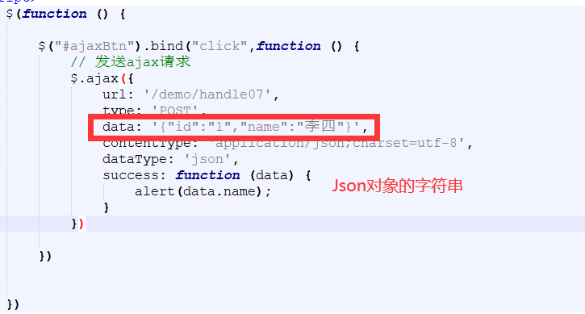
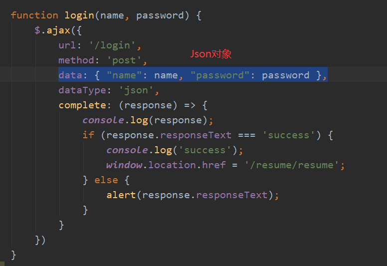

#### 1、isELIgnored属性

 在page directive中的isELIgnored属性用来指定是否忽略。格式为： ＜%@ page isELIgnored＝"true|false"%＞ 如果设定为真，那么JSP中的表达式被当成字符串处理。比如下面这个表达式${2000 % 20}, 在isELIgnored＝"true"时输出为${2000 % 20}，而isELIgnored＝"false"时输出为100。Web容器默认isELIgnored＝"false"。

#### 2、URI和URL的区别比较与理解

一、URI

<1>什么是URI

URI，通一资源标志符(Uniform Resource Identifier， URI)，表示的是web上每一种可用的资源，如 HTML文档、图像、视频片段、程序等都由一个URI进行定位的。

<2>URI的结构组成

URI通常由三部分组成：

①访问资源的命名机制；

②存放资源的主机名；

③资源自身的名称。

<3>URI举例

如：https://blog.csdn.net/qq_32595453/article/details/79516787

我们可以这样解释它：

①这是一个可以通过https协议访问的资源，

②位于主机 blog.csdn.net上，

③通过“/qq_32595453/article/details/79516787”可以对该资源进行唯一标识（注意，这个不一定是完整的路径）

注意：以上三点只不过是对实例的解释，以上三点并不是URI的必要条件，URI只是一种概念，怎样实现无所谓，只要它唯一标识一个资源就可以了。

二、URL

URL是URI的一个子集。它是Uniform Resource Locator的缩写，译为“统一资源定位 符”。

通俗地说，URL是Internet上描述信息资源的字符串，主要用在各种WWW客户程序和服务器程序上。

采用URL可以用一种统一的格式来描述各种信息资源，包括文件、服务器的地址和目录等。URL是URI概念的一种实现方式。

URL的一般格式为(带方括号[]的为可选项)：

protocol :// hostname[:port] / path / [;parameters][?query]#fragment

URL的格式由三部分组成： 

①第一部分是协议(或称为服务方式)。

②第二部分是存有该资源的主机IP地址(有时也包括端口号)。

③第三部分是主机资源的具体地址，如目录和文件名等。

第一部分和第二部分用“://”符号隔开，

第二部分和第三部分用“/”符号隔开。

第一部分和第二部分是不可缺少的，第三部分有时可以省略。 

三、URI和URL之间的区别

从上面的例子来看，你可能觉得URI和URL可能是相同的概念，其实并不是，URI和URL都定义了资源是什么，但URL还定义了该如何访问资源。URL是一种具体的URI，它是URI的一个子集，它不仅唯一标识资源，而且还提供了定位该资源的信息。URI 是一种语义上的抽象概念，可以是绝对的，也可以是相对的，而URL则必须提供足够的信息来定位，是绝对的。

#### 3、重定向和转发的区别及应用

##### 重定向

重定向过程：客户浏览器发送http请求,web服务器接受后发送302状态码响应及对应新的location给客户浏览器,客户浏览器发现是302响应，则自动再发送一个新的http请求，请求url是新的location地址,服务器根据此请求寻找资源并发送给客户。在这里location可以重定向到任意URL，既然是浏览器重新发出了请求，则就没有什么request传递的概念了。在客户浏览器路径栏显示的是其重定向的路径，客户可以观察到地址的变化的。重定向行为是浏览器做了至少两次的访问请求的。

重定向到某一个页面。
response.sendRedirect(“xx.jsp”);
最先开始程序员们使用的重定向方法：response.setStatus(302);response.addHeader(“Location”,”URL”);

sendRedirect()这个方法属于response的方法，当这个请求处理完之后，看到response.senRedirect()，将立即返回客户端，然后客户端再重新发送一个请求，去访问xx.jsp页面。

重定向流程为：客户端请求—-响应，遇到sendRedirect()，返回响应—-客户端再次请求xx.jsp页面—-响应。
这里两个请求互不干扰，相互独立，在前面request里面setAttribute()的任何东西，在后面的request里面都获得不了。

总结一下：在response.sendRedirect(“xx.jsp”);里面是两个请求，两个响应，地址栏会发生改变。

##### 转发

转发过程：客户浏览器发送http请求,web服务器接受此请求,调用内部的一个方法在容器内部完成请求处理和转发动作,将目标资源发送给客户;在这里，转发的路径必须是同一个web容器下的url，其不能转向到其他的web路径上去，中间传递的是自己的容器内的request。在客户浏览器路径栏显示的仍然是其第一次访问的路径，也就是说客户是感觉不到服务器做了转发的。转发行为是浏览器只做了一次访问请求。

通过转发将请求提交给别的地方进行处理
request.getRequestDispatcher(“new.jsp”).forward(request,response);
当发送请求时，服务器会根据请求创建一个代表请求的request对象和一个代表响应的response对象。
当response返回数据时，并不是直接提交到页面上，而是先存储在了response自己的缓存区，当整个请求结束的时候，服务器会将response缓存区中的内容全部取出，返回给页面。

当多次forward时会报以下错误：

java.lang.IllegalStateException: Illegal access: this web application instance has been stopped already. Could not load [com.mysql.jdbc.ProfilerEventHandlerFactory]. The following stack trace is thrown for debugging purposes as well as to attempt to terminate the thread which caused the illegal access.
主要意思是这个应用程序已经被停止了，没有办法加载[com.mysql.jdbc.ProfilerEventHandlerFactory]，并终止导致非法访问的线程。

forward能不能被执行取决于response有没有被提交，如果response被提交了，就会抛出异常，如果response没有被提交，forward会被执行，而response缓存区中的内容将被清空，之前传过来的数据也将丢失，如果需要再次传输数据，可以通过request.setAttribute(“xxx”, 传递的信息);将信息放到request中，而转发的对象可以通过request.getAttribute(“xxx”)获取传过来的信息

总结一下：一次请求只会有一次响应，当响应结束提交，没有办法再次向页面提交数据。整个流程都是在服务器端完成的，而且是在同一个请求里面完成的，整个转发一个请求，一个响应，地址栏不会发生变化。

重定向的跨域访问：
重定向可以跨域访问，而转发是在web服务器内部进行的，不能跨域访问。
同源策略：指的是浏览器对不同源的脚本或者文本的访问方式进行的限制。两个页面具有相同的协议，主机（也常说域名），端口，三个要素缺一不可。
页面中的链接，重定向以及表单提交是不会受到同源策略限制的。

#### **4、JSON对象和JSON字符串**

在SpringMVC环境中，@RequestBody接收的是一个Json对象的字符串，而不是一个Json对象。然而在ajax请求往往传的都是Json对象，用 JSON.stringify(data)的方式就能将对象变成字符串。

同时ajax请求的时候也要指定dataType: "json",contentType:"application/json" 这样就可以轻易的将一个对象或者List传到Java端！





#### 5、maven-compiler-plugin 插件详解

maven是个项目管理工具，如果我们不告诉它我们的代码要使用什么样的jdk版本编译的话，它就会用maven-compiler-plugin默认的jdk版本来进行处理，这样就容易出现版本不匹配，以至于可能导致编译不通过的问题。

maven的默认编译使用的jdk版本貌似很低，使用maven-compiler-plugin插件可以指定项目源码的jdk版本，编译后的jdk版本，以及编码。

<plugin>                                                                                                                                     
    <!-- 指定maven编译的jdk版本,如果不指定,maven3默认用jdk 1.5 maven2默认用jdk1.3 -->                                                                         
    <groupId>org.apache.maven.plugins</groupId>                                                                                               
    <artifactId>maven-compiler-plugin</artifactId>                                                                                            
    <version>3.1</version>                                                                                                                    
    <configuration>                                                                                                                           
        <!-- 一般而言，target与source是保持一致的，但是，有时候为了让程序能在其他版本的jdk中运行(对于低版本目标jdk，源代码中不能使用低版本jdk中不支持的语法)，会存在target不同于source的情况 -->                    
        <source>1.8</source> <!-- 源代码使用的JDK版本 -->                                                                                             
        <target>1.8</target> <!-- 需要生成的目标class文件的编译版本 -->                                                                                     
        <encoding>UTF-8</encoding><!-- 字符集编码 -->
        <skipTests>true</skipTests><!-- 跳过测试 -->                                                                             
        <verbose>true</verbose>
        <showWarnings>true</showWarnings>                                                                                                               
        <fork>true</fork><!-- 要使compilerVersion标签生效，还需要将fork设为true，用于明确表示编译版本配置的可用 -->                                                        
        <executable><!-- path-to-javac --></executable><!-- 使用指定的javac命令，例如：<executable>${JAVA_1_4_HOME}/bin/javac</executable> -->           
        <compilerVersion>1.3</compilerVersion><!-- 指定插件将使用的编译器的版本 -->                                                                         
        <meminitial>128m</meminitial><!-- 编译器使用的初始内存 -->                                                                                      
        <maxmem>512m</maxmem><!-- 编译器使用的最大内存 -->                                                                                              
        <compilerArgument>-verbose -bootclasspath ${java.home}\lib\rt.jar</compilerArgument><!-- 这个选项用来传递编译器自身不包含但是却支持的参数选项 -->               
    </configuration>                                                                                                                          
</plugin>    


#### 6、自定义类型转换器

自定义类型转换器

package com.springmvc.utils;

import org.springframework.core.convert.converter.Converter;

import java.text.ParseException;
import java.text.SimpleDateFormat;
import java.util.Date;

/**
 * 自定义类型转换器实现改接口，Converter<S,T>

 * S：source，转换前的数据类型

 * T：target，转换后的数据类型
     */
    public class DateConverter implements Converter<String,Date> {
    @Override
    public Date convert(String source) {
        SimpleDateFormat simpleDateFormat = new SimpleDateFormat("yyyy-MM-dd");
        try {
            return simpleDateFormat.parse(source);
        } catch (ParseException e) {
            e.printStackTrace();
        }
        return null;
    }
    }

    注册自定义类型转换器

<!-- 注册自定义类型转换类-->
    <bean id="conversionService" class="org.springframework.context.support.ConversionServiceFactoryBean">
        <property name="converters">
            <set>
                <bean class="com.springmvc.utils.DateConverter"/>
            </set>
        </property>
    </bean>         

自动注册最合适的处理器映射器，处理器适配器（调用handler方法）

<mvc:annotation-driven conversion-service="conversionService"/>        

#### 7、SpringMVC中的异常处理

Controller—>Service—>Dao层，异常统一向上抛出，可以自定义全局异常处理器统一处理异常

异常类型：编译异常、运行时异常；运行时异常、预期异常（自定义异常）

l 自定义异常

```
package com.springmvc.exception;

public class MyException extends Exception {
    private String message;

    public MyException(String message) {
        this.message = message;
    }

    @Override
    public String getMessage() {
        return message;
    }
}
```

l 自定义异常处理器

```
package com.springmvc.exception;

import org.springframework.web.servlet.HandlerExceptionResolver;
import org.springframework.web.servlet.ModelAndView;

import javax.servlet.http.HttpServletRequest;
import javax.servlet.http.HttpServletResponse;

public class MyExceptionResolver implements HandlerExceptionResolver {
    @Override
    public ModelAndView resolveException(HttpServletRequest request, HttpServletResponse response, Object handler, Exception ex) {

        String message = null;
        if(ex instanceof MyException) {
            // 自定义异常
            message = ex.getMessage();
        }else {
            // 运行时异常
            message = "系统出现未知异常，请联系管理员";
        }

        // 跳转到一个友好的提示页面
        ModelAndView modelAndView = new ModelAndView();
        modelAndView.addObject("exception",message);
        modelAndView.setViewName("exception");
        return modelAndView;
    }
}
<bean id="myExceptionResolver" class="com.springmvc.exception.ExceptionHandler"></bean>
```

#### 8、SpringMVC中拦截器的使用

##### 认识拦截器

l Servlet：处理Request请求和Response响应

l 过滤器（Filter）：对Request请求起到过滤的作用，****作用在Servlet之前\****，如果配置为/*可以对所有的资源访问（servlet、js/css静态资源等）进行过滤处理

l 监听器（Listener）：实现了javax.servlet.ServletContextListener 接口的服务器端组件，它随Web应用的启动而启动，只初始化一次，然后会一直运行监视，随Web应用的停止而销毁

作用一：做一些初始化工作

作用二：监听web中的特定事件，比如HttpSession,ServletRequest的创建和销毁；变量的创建、销毁和修改等。可以在某些动作前后增加处理，实现监控，比如统计在线人数，利用HttpSessionLisener等。

l 拦截器（Interceptor）：是SpringMVC、Struts等表现层框架自己的，不会拦截jsp/html/css/image的访问等，只会拦截访问的控制器方法（Handler）。

从配置的角度也能够总结发现：serlvet、filter、listener是配置在web.xml中的，而interceptor是配置在表现层框架自己的配置文件中的

在Handler业务逻辑执行之前拦截一次

在Handler逻辑执行完毕但未跳转页面之前拦截一次

在跳转页面之后拦截一次

[](https://github.com/lagouedu/Basic-document/blob/master/img-folder/SpringMVC/1576485918159.png)

##### SpringMVC中自定义拦截器

l 实现HandlerInterceptor接口

```
package com.springmvc.interceptor;

import org.springframework.web.method.HandlerMethod;
import org.springframework.web.servlet.HandlerInterceptor;
import org.springframework.web.servlet.ModelAndView;

import javax.servlet.http.HttpServletRequest;
import javax.servlet.http.HttpServletResponse;

/**
 * SpringMVC中自定义拦截器实现HandlerInterceptor接口
 */
public class MyInterceptor implements HandlerInterceptor {

    /**
     * 之前执行：Handler逻辑真正执行之前执行
     * @param request
     * @param response
     * @param handler
     * @return 代表是否放行，true放行，false中止
     */
    @Override
    public boolean preHandle(HttpServletRequest request, HttpServletResponse response, Object handler) {
        HandlerMethod handlerMethod = (HandlerMethod)handler;
        System.out.println("===============>>>preHandle0:" + ((HandlerMethod) handler).getMethod().getName());
        return true;
    }

    /**
     * 之中执行：Handler逻辑真正执行完成但尚未返回页面
     * @param request
     * @param response
     * @param handler
     * @param modelAndView
     */
    @Override
    public void postHandle(HttpServletRequest request, HttpServletResponse response, Object handler, ModelAndView modelAndView) {
        //modelAndView.addObject("nowDate","123");
        //modelAndView.setViewName("error");
        System.out.println("===============>>>postHandle0");
    }


    /**
     * 之后执行：返回页面之后执行
     * @param request
     * @param response
     * @param handler
     * @param ex
     */
    @Override
    public void afterCompletion(HttpServletRequest request, HttpServletResponse response, Object handler, Exception ex) {
        System.out.println("===============>>>afterCompletion0");
    }
}
```

l 配置拦截器

```
<mvc:interceptors>
    <mvc:interceptor>
        <mvc:mapping path="/**"/>
        <bean class="com.springmvc.interceptor.MyHandlerInterceptor"/>
    </mvc:interceptor>
    <mvc:interceptor>
        <mvc:mapping path="/**"/>
        <bean class="com.springmvc.interceptor.MyHandlerInterceptor1"/>
    </mvc:interceptor>
    <mvc:interceptor>
        <mvc:mapping path="/**"/>
        <bean class="com.springmvc.interceptor.MyHandlerInterceptor2"/>
    </mvc:interceptor>
</mvc:interceptors>
```

l 拦截器链（Interceptor Chain）

[](https://github.com/lagouedu/Basic-document/blob/master/img-folder/SpringMVC/1576485938879.png)

拦截器链执行时，拦截器链正常流程测试

preHandle按照拦截器配置顺序执行

postHandle按照拦截器配置倒序执行

afterCompletion按照拦截器配置倒序执行

拦截器链中断流程测试

拦截器链中有中断时，整个链中的拦截器的postHandle都不会执行


#### 9、继承（extends）、实现（implements）

Java 类只能继承一个类，可以实现多个接口

Java接口可以继承多个接口

#### 10、HTML <form> 标签的 enctype 属性

##### 定义和用法

enctype 属性规定在发送到服务器之前应该如何对表单数据进行编码。

默认地，表单数据会编码为 "application/x-www-form-urlencoded"。就是说，在发送到服务器之前，所有字符都会进行编码（空格转换为 "+" 加号，特殊符号转换为 ASCII HEX 值）。

语法
<form enctype="value">
application/x-www-form-urlencoded	在发送前编码所有字符（默认）
multipart/form-data	不对字符编码。在使用包含文件上传控件的表单时，必须使用该值。
text/plain	空格转换为 "+" 加号，但不对特殊字符编码。

#### 11、路径

（1）、绝对路径就是在路径开头**加“/”**，那路径的起始就是服务器IP地址；

（2）、而相对路径就是开头**不加“/”，**而起始就是发起跳转的文件的所在路径；