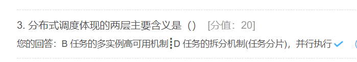

**哈希算法的应用**

  1、场景一：安全加密

​    日常用户密码加密通常使用的都是 md5、sha等哈希函数，因为不可逆，而且微小的区别加密之后的结果差距很大，所以安全性更好。

  2、场景二：唯一标识 

​    比如 URL 字段或者图片字段要求不能重复，这个时候就可以通过对相应字段值做 md5 处理，将数据统一为 32 位长度从数据库索引构建和查询角度效果更好，此外，还可以对文件之类的二进制数据做 md5 处理，作为唯一标识，这样判定重复文件的时候更快捷。

  3、场景三：数据校验

​    比如从网上下载的很多文件（尤其是P2P站点资源），都会包含一个 MD5 值，用于校验下载数据的完整性，避免数据在中途被劫持篡改。

  4、场景五：散列函数

​    前面已经提到，PHP 中的 md5、sha1、hash 等函数都是基于哈希算法计算散列值

  5、场景五：负载均衡

​    对于同一个客户端上的请求，尤其是已登录用户的请求，需要将其会话请求都路由到同一台机器，以保证数据的一致性，这可以借助哈希算法来实现，通过用户 ID 尾号对总机器数取模（取多少位可以根据机器数定），将结果值作为机器编号。

  6、场景六：分布式缓存 

​    分布式缓存和其他机器或数据库的分布式不一样，因为每台机器存放的缓存数据不一致，每当缓存机器扩容时，需要对缓存存放机器进行重新索引（或者部分重新索引），这里应用到的也是哈希算法的思想。

**“虚拟节点”**（ virtual node ）是实际节点在 hash 空间的复制品（ replica ），一实际个节点对应了若干个“虚拟节点”，这个对应个数也成为“复制个数”，“虚拟节点”在 hash 空间中以 hash 值排列。

